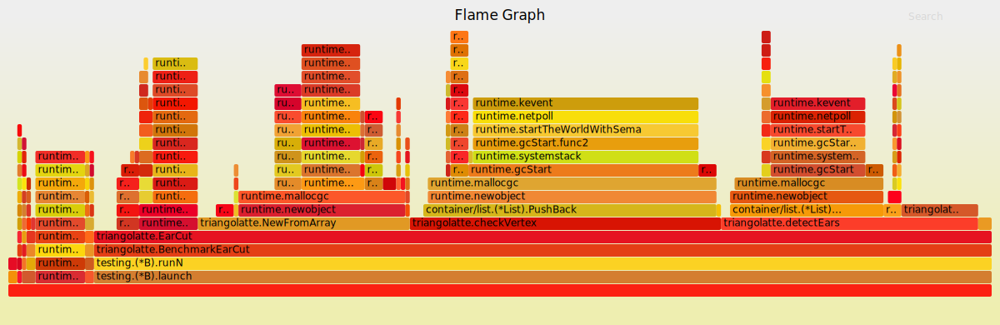

# triangolatte

[](https://travis-ci.org/Tchayen/triangolatte)
[](https://coveralls.io/github/Tchayen/triangolatte?branch=master)
[](https://godoc.org/github.com/Tchayen/triangolatte)

2D triangulation library. Allows translating lines and polygons (both based on
points) to the language of GPUs.

Features normal and miter joint line triangulation. Handles polygons using ear
clipping algorithm with hole elimination included.

> **For reference:** _triangulation of all buildings in Cracow works for 99.76%
of cases and takes 3.43s._

## Table of contents

- [Installation](#installation)
- [Usage](#usage)
- [Examples](#examples)
- [Features](#features)
  - [API](#api)
  - [Helpers](#helpers)
  - [Types](#types)
- [Tests](#tests)
  - [Flame Graphs](#flame-graphs)
- [Benchmarks](#benchmarks)
- [Future plans](#future-plans)
- [Contributing](#contributing)
- [License](#license)

## Installation

Nothing surprising
```bash
go get github.com/Tchayen/triangolatte
```

## Usage

#### Basic example
```go
vertices := []Point{{10, 20}, {30, 40}, {50, 60}}
t, err = triangolatte.EarCut(vertices)
```

## Examples

In `/examples` you can find:
- **city** – triangulation of whole city downloaded from Open Street Map
- **buildings** – full-blown WebGL previewer of buildings triangulated in _city_ example
- **gpx** – GPX format parsing and triangulation of its data

You will find instructions for running the code there.

## Features

> **NOTE**: _this library is developed mostly with map data triangulation in
mind and it will be its main performance target._

### API

#### `EarCut(points []Point, holes [][]Point) ([]float64, error)`

Takes array of points and produces array of triangle coordinates.

Based on the following [paper](https://www.geometrictools.com/Documentation/TriangulationByEarClipping.pdf).

#### `JoinHoles(points [][]Point) ([]Point, error)`

Removes holes, joining them with the rest of the polygon. Provides preprocessing
for `EarCut`. First element of the points array is the outer polygon, the rest
of them are considered as holes to be removed.

#### `Normal(points []Point, width int) (triangles []float64)`

Normal triangulation. Produces joints that are ugly in zoom, but fast to compute
and sometimes acceptable.

#### `Miter(points []Point, width int) (triangles []float64)`

Triangulates lines using miter joint. With little computational overhead,
produces no more vertices than normal one. Comes with one drawback: very sharp
angles can potentially explode to infinity.

Refer to this [forum post](https://forum.libcinder.org/topic/smooth-thick-lines-using-geometry-shader)
for sketches, code examples and ideas.

### Helpers

#### `LoadPointsFromFile(fileName string) ([][]Point, error)`

Takes file name and returns array of arrays of points.

#### `Deviation(data []Point, holes [][]Point, t []float64) (real, triangles, deviation float64)`

Given original points, holes and triangles calculated by the `EarCut(...)`, can
be used to determine how much obtained polygon area differs from the real one.
Might have false positives when areas of the triangles sum up to a correct value,
while their positions make no sense.

#### `DegreesToMeters(point Point) Point`

Converts degrees from formats like `*.geojson` to meters using Web Mercator
projection the one used by all internet maps and almost for sure the one you
need if you are not sure.

### Types

For calculations using points.
```go
type Point struct {
  X, Y float64
}
```

## Tests

Code is (more or less) covered in tests. You can run them like this:

```bash
go test -v
```

You can also run benchmarks for selected functions (refer to the `*_test.go` files for availability). For example:

```bash
go test -run NONE -bench IsInsideTriangle
```

### Flame Graphs

What is a _flame graph_? Simply speaking, a human-readable insight into what
kept CPU busy (and it resembles fire 🔥).

It has intelligent zoom that lets you narrow down the range to a particular
function from the flame and go back quickly at will.

It also supports hovering while still being a regular, valid `*.svg` file.



You can view an example of `EarCut` benchmark flame graph in [assets/torch.svg](assets/torch.svg).

> **NOTE:** _you must display the image file directly to use cool features
described above._

#### Generating flame graph

Install [go-torch](https://github.com/uber/go-torch) and [FlameGraph](https://github.com/brendangregg/FlameGraph)
if you haven't done it before.

```bash
go get github.com/uber/go-torch

# In any directory, $HOME for example.
git clone https://github.com/brendangregg/FlameGraph

# You might want to add this to your .bashrc or other equivalent.
# NOTE: replace the path with the one you chose for your FlameGraph installation.
export PATH=$PATH:$HOME/FlameGraph
```

From now on, every time you want to generate a flame graph, simply run the
commands below:

> You can replace `EarCut` with any function name from `*_test.go` file, with
> name starting with `Benchmark*`, stripping the prefix.
>
> For example, `func BenchmarkEarCut(...)` became `EarCut`.

```bash
go test -run NONE -bench EarCut -cpuprofile prof.cpu
go tool pprof triangolatte.test prof.cpu
go-torch triangolatte.test prof.cpu
```

Now you can open newly generated `torch.svg` in your web browser.

## Benchmarks

> **NOTE:** _This section contains work in progress._

`EarCut()` on shape with 10 vertices takes `754ns`.

Triangulation of 74 thousand buildings runs in `3.43s`.

## Future plans

### Optimizations

- allow reusing point array for massive allocation reduction
- test z-ordering for early returning in ear detection

### Making the library more professional

By providing more examples, real benchmarks with comparison to libraries in
other languages.

### WebAssembly

One of the core plans for this library's development is creating, as soon as it
becomes possible, some kind of [WebAssembly](https://webassembly.org/) module
for use in JS.

## Contributing

You are welcome to create an issue or pull request if you've got an idea what to do.

Don't have one, but still want to contribute? Get in touch with me and we can
brainstorm some ideas.

## License

MIT License – refer to the [LICENSE](LICENSE) file.
