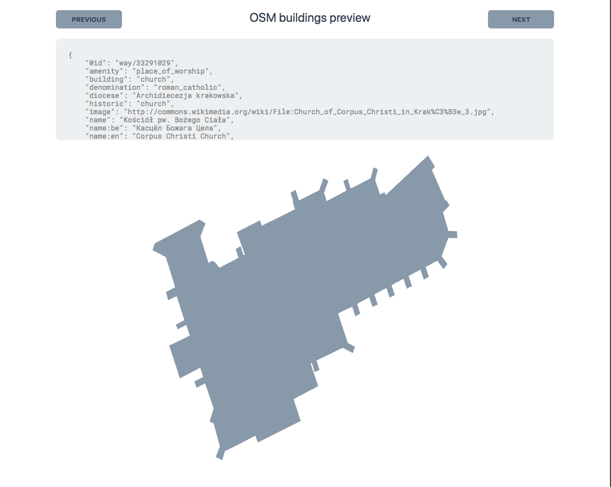

# WebGL example



Starts http server serving data loaded from `assets/json_tmp` on
`localhost:3000/api/data` (refer to `examples/city` for `json_tmp` creation or provide any valid `*.geojson` file).

`localhost:3000` returns JS app rendering data downloaded from server with ability to grade buildings triangulation.

## Running

Run the Go server with

```bash
go run server.go
```

then, watch JS files in separate terminal
```bash
yarn start
```

and finally, visit `http://localhost:3000` to see results.
