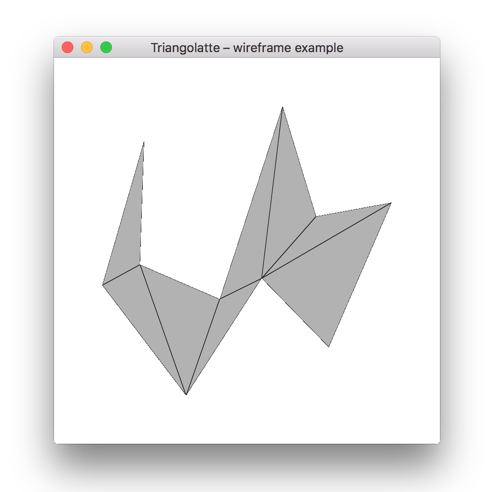

# wireframe



Desktop OpenGL app for previewing triangulated shapes with wireframes.

## Installation

This examples requires several dependencies.

```bash
go get -u github.com/go-gl/glfw/v3.2/glfw
go get -u github.com/go-gl/gl/v4.1-core/gl
```

## Running

```bash
go run wireframe.go
```

UI window should appear. Any errors will be printed to the console in which you
have typed the command above.